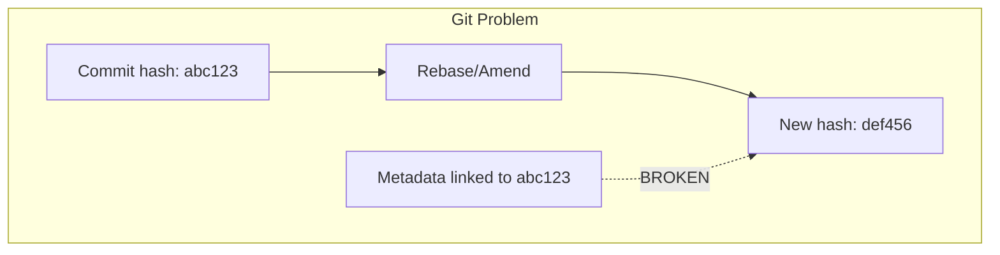
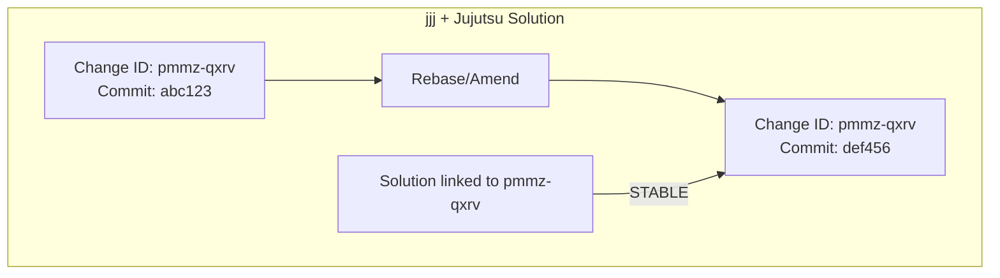

# Change ID Tracking

`jjj` leverages Jujutsu's **stable Change IDs** to maintain metadata consistency even as the underlying Git commit history is rewritten.

## The Problem with Git Commit IDs

In standard Git, every time you rebase, amend, or squash, the commit hash changes. If project metadata (like a link between a task and a branch) relies on commit hashes, it breaks constantly.



## The Jujutsu Solution: Change IDs

Jujutsu introduces a stable **Change ID** that remains constant even if the commit hash changes during a rebase. `jjj` uses these Change IDs to anchor solutions to the logical work being performed.



## How the Mapping Works

When you run `jjj solution attach`, `jjj` records the current change ID in the solution's internal metadata:

```yaml
# solution file
id: 01958c4d-...
title: Implement caching
status: testing
change_ids:
  - pmmz-qxrv  # Stable Jujutsu Change ID
```

### Automatic Attachment
When you use `jjj solution resume "Implement caching"`, `jjj` does the following:
1.  Creates a new `jj` change.
2.  Captures the Change ID of that new change.
3.  Automatically appends it to the solution's `change_ids` list.

### Multi-Change Solutions
A single solution can span multiple `jj` changes. `jjj` tracks all of them, allowing the dashboard to show you everything related to a conjecture regardless of how many individual commits or changes it involves.

## Benefits
*   **Robust Rebasing**: You can rebase your feature branch as much as you want; `jjj` will never lose track of which solution that code belongs to.
*   **No Manual Bookkeeping**: The stable mapping happens automatically behind the scenes.
*   **Contextual Status**: By knowing which code belongs to which problem, `jjj status` can provide a high-level view of your progress that reflects the actual state of your workspace.

