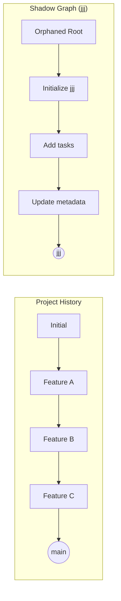

# Storage & Metadata

jjj stores all project management metadata in a **shadow graph**—a separate, orphaned commit history in your Jujutsu repository.

## The Shadow Graph

### What is it?

A shadow graph is an orphaned commit history that exists in your repository but is completely separate from your project code:



These histories never merge. They coexist peacefully in the same repository.

### Why Use a Shadow Graph?

Traditional approaches to storing metadata have problems:

#### ❌ Polluting Project History

```
# Bad: Metadata mixed with code
◯ Add user authentication
│
◯ jjj: Update problem status       ← Noise!
│
◯ Fix login bug
│
◯ jjj: Create solution             ← More noise!
```

This clutters `git log` and makes project history messy.

#### ❌ Separate Git Repository

```
project/          # Main code
project-meta/     # Metadata in separate repo
```

Problems:
- Have to sync two repositories
- Lose atomic operations
- Complex deployment

#### ✅ Shadow Graph (jjj's Approach)

```
# Same repo, separate histories
jj log -r main                    # Clean project history
jj log -r jjj                # Metadata history

jj git push --all                 # Push both at once
```

Benefits:
- ✅ One repository to manage
- ✅ Atomic push/pull of code + metadata
- ✅ Clean project history
- ✅ Easy to reset or delete metadata

## File Structure

When you run `jjj init`, it creates this structure on the `jjj` branch:

```
config.toml                                    # Project configuration
milestones/                                    # Milestone storage
├── 01959c4d-e5f6-7a7b-8c9d-0e1f2a3b4c5d.md
└── 01959d5e-f6a7-7b8c-9d0e-1f2a3b4c5d6e.md
problems/                                      # Problem storage
├── 01957d3e-a8b2-7def-8c3a-9f4e5d6c7b8a.md
├── 01958a2b-c3d4-7e5f-6a7b-8c9d0e1f2a3b.md
└── 01958b3c-d4e5-7f6a-7b8c-9d0e1f2a3b4c.md
solutions/                                     # Solution storage
├── 01958c4d-e5f6-7a7b-8c9d-0e1f2a3b4c5d.md
└── ...
critiques/                                     # Critique storage
├── 01958d5e-f6a7-7b8c-9d0e-1f2a3b4c5d6e.md
└── 01958e6f-a7b8-7c9d-0e1f-2a3b4c5d6e7f.md
events.jsonl                                   # Event log
```

Entity files are named with their full UUID7 identifier. UUID7 is time-ordered, so files naturally sort chronologically.

## Storage Layer Implementation

### MetadataStore

The `MetadataStore` struct manages all metadata operations:

```rust
pub struct MetadataStore {
    meta_path: PathBuf,          // Path to .jj/jjj-meta
    jj_client: JjClient,         // Main repo client
    meta_client: JjClient,       // Metadata workspace client
}
```

### Initialization

When you run `jjj init`:

1. **Create orphaned root**:
   ```bash
   jj new --no-parent -m "Initialize jjj metadata"
   ```

2. **Create bookmark**:
   ```bash
   jj bookmark create jjj
   ```

3. **Create workspace**:
   ```bash
   jj workspace add .jj/jjj-meta -r jjj
   ```

4. **Initialize directories**:
   ```
   mkdir -p .jjj/{problems,solutions,critiques,milestones}
   ```

5. **Create default config**:
   ```toml
   # .jj/jjj-meta/config.toml
   [board]
   columns = ["TODO", "In Progress", "Review", "Done"]

   [tags]
   allowed = ["backend", "frontend", "docs", "tests"]
   ```

### File Formats

#### TOML for Configuration

```toml
# config.toml
[board]
columns = ["TODO", "In Progress", "Review", "Done"]

[tags]
allowed = ["backend", "frontend", "api", "ui"]

# Review is now per-solution via assigned reviewers.
# See solution --submit flag and jjj solution submit.
```

#### Markdown with YAML Frontmatter for Work Items

Problems, solutions, critiques, and milestones use markdown files with YAML frontmatter:

```markdown
# problems/01957d3e-a8b2-7def-8c3a-9f4e5d6c7b8a.md
---
id: 01957d3e-a8b2-7def-8c3a-9f4e5d6c7b8a
title: Search is slow on large datasets
status: open
priority: high
assignee: alice
milestone_id: 01959c4d-e5f6-7a7b-8c9d-0e1f2a3b4c5d
github_issue: 42
tags:
  - backend
  - performance
created_at: 2025-11-23T10:00:00Z
updated_at: 2025-11-23T15:30:00Z
---

Users are reporting slow search results when querying datasets with more than 10,000 records.

## Context

- Search takes 5+ seconds
- Server logs show full table scans
```

Entity IDs are UUID7 (time-ordered UUIDs). In listings, truncated prefixes like `01957d` are shown for readability, with automatic extension for uniqueness.

Why YAML frontmatter + Markdown?
- Human-readable and writable
- Structured metadata in frontmatter
- Free-form description in markdown body
- Native Rust ecosystem support (serde)
- Easy to edit with any text editor

## Transaction Model

### Atomic Updates

jjj uses a simple transaction model:

```rust
store.with_metadata("Create problem", || {
    // 1. Perform operations
    let problem = Problem::new(...);
    store.save_problem(&problem)?;

    // 2. All operations succeed or all fail
    Ok(())
})?;
// 3. Metadata committed atomically
```

This translates to writing markdown files to the shadow graph and committing.

### Conflict Resolution

If two users modify metadata simultaneously:

```
User A                              User B
──────                              ──────
jjj problem new "Fix login"         jjj problem new "Add search"
  ↓                                   ↓
Creates 01957d...                   Creates 01958a...
  ↓                                   ↓
jj git push                         jj git push
  ↓                                   ↓
  └──────── CONFLICT! ────────────┘
```

Because each problem gets a unique UUID7, the actual files never conflict (different filenames). Conflicts only occur when editing the same entity.

Resolution:

```bash
# Pull and resolve
jj git fetch
jj bookmark track jjj@origin

# jj automatically merges file-based changes
# If both created different files → no conflict!

# If same file modified → manual merge may be needed
```

## Sync Model

### Push

```bash
# Push metadata bookmark
jj git push --bookmark jjj

# Or push all bookmarks
jj git push --all
```

What gets pushed:
- All metadata commits
- Shadow graph history
- Configuration changes

### Pull

```bash
# Fetch metadata
jj git fetch

# Track remote bookmark
jj bookmark track jjj@origin

# Metadata automatically merged
```

### Working Offline

jjj is designed for offline-first workflows:

```bash
# Create problems offline
jjj problem new "Fix login flow" --priority p1
jjj problem new "Add test coverage"

# Propose solutions (reference by title)
jjj solution new "Refactor auth handler" --problem "login flow"

# Later, when online
jj git push --all
```

All metadata is local until you push!

## Performance

### ID Generation

IDs are UUID7, generated locally without coordination:

```rust
pub fn generate_id() -> String {
    uuid::Uuid::now_v7().to_string()
}
```

Time complexity: O(1) - constant time, no scanning required.

UUID7 provides:
- **No conflicts**: UUIDs are globally unique, so distributed teams can create entities without coordination
- **Time ordering**: UUID7 encodes creation time, so IDs sort chronologically
- **Human-friendly prefixes**: The first 6+ hex characters are usually unique enough for display

### File System Layout

Each work item is a separate file:

✅ Benefits:
- Parallel access
- Minimal conflicts
- Easy to inspect/edit manually

❌ Trade-offs:
- More files = slower directory listing
- Mitigated by using separate directories per type

### SQLite Runtime Cache

jjj maintains a local SQLite database at `.jj/jjj.db` as a runtime index/cache. The canonical data remains in the shadow graph (markdown files on the `jjj` bookmark); the SQLite database is derived and can be fully rebuilt at any time via `jjj db rebuild`.

The SQLite layer provides:

- **Full-text search (FTS5)**: All entity titles and bodies are indexed for fast `jjj search` queries.
- **Relational indexes**: Foreign-key relationships (solutions to problems, critiques to solutions, problems to milestones) enable fast lookups without scanning files.
- **Semantic embeddings**: Optional vector embeddings stored alongside entities for similarity search.
- **Schema versioning**: The database self-manages its schema version (currently v5) and automatically rebuilds when the schema changes or if an interrupted sync left it in a dirty state.

The database is populated by reading all markdown files and `events.jsonl` from the shadow graph, then inserting them into SQLite tables. This happens automatically when the database is missing or outdated.

### GitHub Sync Fields

Entities include optional fields for bidirectional GitHub synchronization:

- **Problems**: `github_issue` -- linked GitHub issue number
- **Solutions**: `github_pr` (pull request number), `github_branch` (remote branch name)
- **Critiques**: `github_review_id` -- linked GitHub review ID

These fields are stored in both the YAML frontmatter (canonical) and the SQLite cache (indexed). The `jjj github` command uses the `gh` CLI to push and pull state between the shadow graph and GitHub Issues/PRs.

## Backup and Recovery

### Export Metadata

```bash
# Full backup
jj git bundle create jjj-backup.bundle -r jjj

# Or use plain git
cd .jj/jjj-meta
git bundle create ~/jjj-backup.bundle --all
```

### Restore Metadata

```bash
# Restore from bundle
jj git bundle unbundle jjj-backup.bundle
jj bookmark set jjj -r <restored-commit>
```

### Reset Metadata

If metadata gets corrupted:

```bash
# Option 1: Reset to earlier state
jj bookmark set jjj -r <earlier-commit>

# Option 2: Delete and reinitialize
jj bookmark delete jjj
jjj init
```

**Your project code is never affected!** The shadow graph is completely separate.

## Advantages

### vs. Git Notes

Git notes have problems:
- Not pushed by default
- Easy to lose
- No history
- Awkward APIs

jjj's shadow graph:
- ✅ Pushed with `git push --all`
- ✅ Full commit history
- ✅ Standard jj operations

### vs. GitHub Issues / JIRA

External tools require:
- ❌ Internet connection
- ❌ Account/authentication
- ❌ Separate data store
- ❌ API rate limits

jjj:
- ✅ Works offline
- ✅ Lives in your repo
- ✅ No external dependencies
- ✅ Infinite scalability

### vs. Text Files in Repo

Storing `.md` files in project:
- ❌ Pollutes history
- ❌ Merge conflicts with code
- ❌ Clutters working directory

Shadow graph:
- ✅ Clean project history
- ✅ Independent merge conflicts
- ✅ Hidden from code directory

## Future Enhancements

### Planned Improvements

1. **Compression**: Use zstd for large datasets
2. **Partial clone**: Fetch only recent metadata
3. **Garbage collection**: Prune old review data

### Compatibility

The storage format is designed to evolve:

- YAML frontmatter allows schema evolution
- Version field for migration
- Unknown fields ignored

This means old jjj versions can read newer data (graceful degradation).

## Summary

jjj's storage layer uses a **shadow graph** (canonical markdown files on the `jjj` bookmark) plus a **SQLite runtime cache** (`.jj/jjj.db`) to achieve:

- ✅ Clean separation of metadata and code
- ✅ Atomic operations
- ✅ Offline-first workflow
- ✅ Standard git push/pull
- ✅ Easy backup and recovery
- ✅ Fast full-text search and relational queries via SQLite
- ✅ Optional GitHub sync via `github_issue`, `github_pr`, and `github_review_id` fields

The SQLite database is always derivable from the shadow graph and can be deleted or rebuilt without data loss. This is only possible because of Jujutsu's flexible commit graph and workspace model!

## See Also

- [Design Philosophy](design-philosophy.md) - Why these choices were made
- [Change ID Tracking](change-tracking.md) - How change IDs enable robust metadata
- [CLI Reference](../reference/cli-workflow.md) - Using the storage layer
