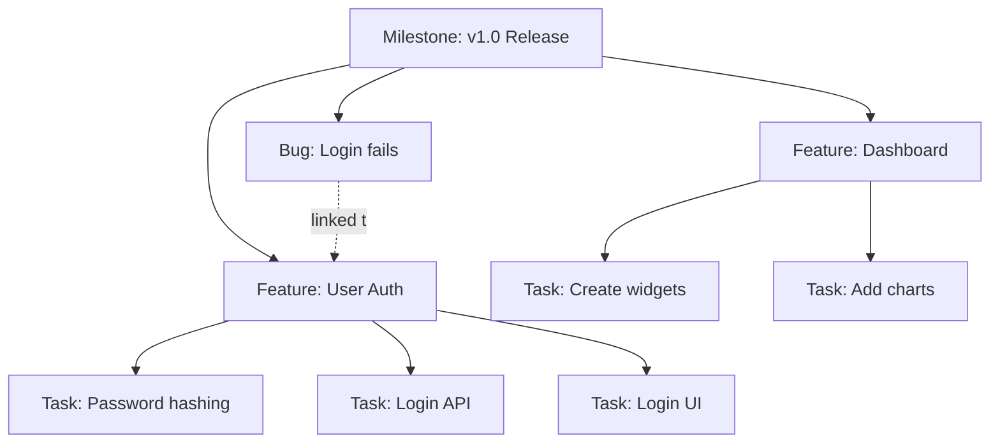

# Work Hierarchy

jjj uses a three-level work hierarchy to organize projects: **Milestones** → **Features** → **Tasks**, with **Bugs** as a special work item type.

## Overview



## The Hierarchy Levels

### Milestones (M-*)

**What**: Release targets, sprints, or delivery dates

**When to use**:
- Planning a release (e.g., "v1.0", "Sprint 5")
- Setting deadline targets
- Grouping features for a specific delivery

**Examples**:
- `M-1: v1.0 Release - Dec 31, 2025`
- `M-2: Q1 2026 Sprint`
- `M-3: Beta Launch - Feb 15, 2026`

**Properties**:
- Unique ID (M-1, M-2, ...)
- Title and description
- Target date (optional)
- Status: Planning → Active → Released → Cancelled
- Contains features and bugs
- Tags for categorization
- Version number (optional, e.g., "1.0.0")

**Create a Milestone**:
```bash
jjj milestone new "v1.0 Release" \
  --date 2025-12-31 \
  --description "Initial public release"
```

### Features (F-*)

**What**: User-facing capabilities or major improvements

**When to use**:
- Something a user would notice
- A capability you'd describe in release notes
- A group of related tasks

**Examples**:
- `F-1: User Authentication`
- `F-2: Dark Mode Theme`
- `F-3: Export to PDF`
- `F-99: Technical Debt Cleanup` (for non-user-facing work)

**Properties**:
- Unique ID (F-1, F-2, ...)
- Title and description (use user story format)
- Status: Backlog → InProgress → Review → Done → Blocked
- Priority: Low, Medium, High, Critical
- Milestone assignment (optional)
- Assignee (feature owner)
- Contains tasks and related bugs
- Tags for categorization
- Story points (optional, for estimation)

**Create a Feature**:
```bash
jjj feature new "User Authentication" \
  --milestone M-1 \
  --priority high \
  --description "As a user, I want to securely log in so I can access my account"
```

### Tasks (T-*)

**What**: Individual units of work (code changes, documentation, etc.)

**When to use**:
- A single change or commit
- Something one person can complete in a few hours/days
- A trackable work item that contributes to a feature

**Examples**:
- `T-1: Implement password hashing`
- `T-2: Create login API endpoint`
- `T-3: Write authentication tests`

**Properties**:
- Unique ID (T-1, T-2, ...)
- Title and description
- **MUST belong to a feature** (required `feature_id`)
- Column placement (TODO, In Progress, Review, Done, etc.)
- Tags for categorization
- Attached change IDs (from jj)
- Assignee
- Version for conflict detection

**Create a Task**:
```bash
# Feature is REQUIRED
jjj task new "Implement password hashing" \
  --feature F-1 \
  --tag backend \
  --tag security
```

!!! warning "Tasks Require Features"
    Every task **must** belong to a feature. This is enforced to keep work organized and prevent orphaned tasks.

    If you have miscellaneous tasks, create organizational features like:
    - `F-99: Technical Improvements`
    - `F-100: Bug Fixes`
    - `F-101: Documentation`

### Bugs (B-*)

**What**: Defects, issues, or unexpected behavior

**When to use**:
- Something is broken
- Behavior doesn't match expectations
- User-reported issues

**Examples**:
- `B-1: Login fails with special characters`
- `B-2: Dark mode doesn't persist`
- `B-3: PDF export crashes on large files`

**Properties**:
- Unique ID (B-1, B-2, ...)
- Title and description
- Severity: Low, Medium, High, Critical
- Status: New → Confirmed → InProgress → Fixed → Closed → WontFix → Duplicate
- Feature link (optional - bugs can be standalone)
- Milestone link (optional - for release planning)
- Assignee and reporter
- Attached change IDs (for fixes)
- Reproduction steps
- Expected vs actual behavior
- Affected/fixed versions

**Create a Bug**:
```bash
jjj bug new "Login fails with special characters" \
  --severity high \
  --repro "1. Enter email with + sign\n2. Click login\n3. Observe error"

# Link to feature and milestone
jjj bug link B-1 --feature F-1 --milestone M-1
```

## Relationship Rules

### Required Relationships

1. **Tasks → Features**: ✅ Required
   - Every task MUST have a feature
   - Use `--feature F-1` when creating tasks

2. **Features → Milestones**: ⚠️ Optional
   - Features can exist without milestones (backlog items)
   - Recommended for release planning

3. **Bugs → Features/Milestones**: ⚠️ Optional
   - Bugs can be standalone (general issues)
   - Link to features when bug affects specific capability
   - Link to milestones when targeting fix for release

### Parent-Child Rules

```
Milestone
  ├── Can contain: Features, Bugs
  └── Cannot contain: Tasks directly

Feature
  ├── Can contain: Tasks, Bugs
  ├── Can belong to: Milestone (optional)
  └── Must have: At least one task to be meaningful

Task
  ├── Must belong to: Feature (required)
  └── Cannot belong to: Milestone directly

Bug
  ├── Can link to: Feature, Milestone (both optional)
  └── Can exist standalone: Yes
```

## Workflow Patterns

### Pattern 1: Release-Driven Development

```bash
# 1. Create milestone for next release
jjj milestone new "v2.0 Release" --date 2026-03-31

# 2. Plan features for this release
jjj feature new "Real-time Collaboration" --milestone M-2 --priority critical
jjj feature new "Plugin System" --milestone M-2 --priority high

# 3. Break features into tasks
jjj task new "WebSocket server implementation" --feature F-4
jjj task new "Conflict resolution algorithm" --feature F-4

# 4. Track progress
jjj milestone show M-2
jjj feature progress F-4

# 5. View roadmap
jjj milestone roadmap
```

### Pattern 2: Feature-First Development

```bash
# 1. Create feature in backlog (no milestone yet)
jjj feature new "Advanced Search"

# 2. Break into tasks
jjj task new "Index database for full-text search" --feature F-5
jjj task new "Build search UI" --feature F-5

# 3. Work on tasks
jjj task attach T-20
jjj task move T-20 "In Progress"

# 4. Later: assign to milestone when prioritized
jjj milestone add-feature M-3 F-5
```

### Pattern 3: Bug Triage Workflow

```bash
# 1. Report bug (standalone, not linked yet)
jjj bug new "Search returns duplicate results" --severity medium

# 2. Triage: link to feature if identified
jjj bug link B-5 --feature F-5

# 3. Prioritize: add to milestone if urgent
jjj bug link B-5 --milestone M-2

# 4. Create task to fix (optional, for tracking)
jjj task new "Deduplicate search results" --feature F-5

# 5. Fix and update status
jjj bug status B-5 fixed
```

## Viewing Hierarchy

### List Everything

```bash
# Show all milestones
jjj milestone list

# Show all features
jjj feature list

# Show all tasks
jjj task list

# Show all bugs
jjj bug list
```

### Filter and Focus

```bash
# Features for a specific milestone
jjj feature list --milestone M-1

# Tasks for a specific feature
jjj feature show F-1  # Shows tasks within feature

# Bugs by severity
jjj bug list --severity critical

# Open bugs only
jjj bug list --open
```

### Progress Views

```bash
# Milestone roadmap
jjj milestone roadmap

# Feature progress
jjj feature progress F-1

# Feature board (all features)
jjj feature board

# Feature board (specific feature)
jjj feature board F-1

# Bug triage view
jjj bug triage
```

## Status Transitions

### Milestone Status Flow

```
Planning → Active → Released
                  ↘ Cancelled
```

- **Planning**: Not started, still being defined
- **Active**: Currently being worked on
- **Released**: Completed and shipped
- **Cancelled**: Abandoned or deprioritized

```bash
jjj milestone show M-1  # Check current status
# Status transitions happen implicitly as work progresses
```

### Feature Status Flow

```
Backlog → InProgress → Review → Done
            ↓
         Blocked
```

- **Backlog**: Not started, planned for future
- **InProgress**: Actively being worked on
- **Review**: Awaiting code review or approval
- **Done**: Completed and merged
- **Blocked**: Cannot proceed due to dependency

```bash
jjj feature move F-1 inprogress
jjj feature move F-1 review
jjj feature move F-1 done
```

### Bug Status Flow

```
New → Confirmed → InProgress → Fixed → Closed
                                    ↘ WontFix
                                    ↘ Duplicate
```

```bash
jjj bug status B-1 confirmed
jjj bug status B-1 inprogress
jjj bug status B-1 fixed
```

### Task Column Flow

Tasks use customizable columns (default: TODO, In Progress, Review, Done):

```bash
jjj task move T-1 "In Progress"
jjj task move T-1 "Review"
jjj task move T-1 "Done"
```

## Priority and Severity

### Feature Priority

**Critical** → **High** → **Medium** → **Low**

```bash
jjj feature new "Security Patch" --priority critical
jjj feature new "Performance Optimization" --priority high
jjj feature new "UI Polish" --priority medium
jjj feature new "Easter Egg" --priority low
```

Use for:
- Release planning (critical items first)
- Resource allocation
- Roadmap ordering

### Bug Severity

**Critical** → **High** → **Medium** → **Low**

```bash
jjj bug new "Data loss on save" --severity critical
jjj bug new "Login fails for some users" --severity high
jjj bug new "UI glitch in dark mode" --severity medium
jjj bug new "Typo in help text" --severity low
```

Use for:
- Bug triage (critical bugs fixed immediately)
- Release blocking decisions
- Team alerting

## Common Patterns

### For Teams Without Features

If you just want simple task tracking:

```bash
# Create a general feature for miscellaneous work
jjj feature new "General Work"

# Create all tasks under it
jjj task new "Fix typo in README" --feature F-1
jjj task new "Update dependencies" --feature F-1
```

### For Solo Developers

You might not need milestones:

```bash
# Just create features and tasks
jjj feature new "Add search functionality"
jjj task new "Implement search index" --feature F-1
jjj task new "Build search UI" --feature F-1
```

### For Large Projects

Use the full hierarchy:

```bash
# Quarterly milestones
jjj milestone new "Q1 2026" --date 2026-03-31
jjj milestone new "Q2 2026" --date 2026-06-30

# Themed features
jjj feature new "Enterprise SSO" --milestone M-1 --priority critical
jjj feature new "Audit Logging" --milestone M-1 --priority high

# Granular tasks
jjj task new "Integrate with Okta" --feature F-10
jjj task new "SAML authentication flow" --feature F-10
```

## JSON Output

All hierarchy commands support `--json`:

```bash
# Export complete hierarchy
jjj milestone list --json > milestones.json
jjj feature list --json > features.json
jjj task list --json > tasks.json
jjj bug list --json > bugs.json

# Process with jq
jjj feature list --milestone M-1 --json | \
  jq '[.[] | {id, title, status, task_count: (.task_ids | length)}]'
```

## Best Practices

!!! tip "Start Small, Scale Up"
    Begin with just features and tasks. Add milestones when planning releases. Use bugs when needed.

!!! tip "Use Consistent Naming"
    - Milestones: "v1.0 Release", "Sprint 5", "Q2 2026"
    - Features: User stories or capabilities ("User Authentication", "Dark Mode")
    - Tasks: Action-oriented ("Implement...", "Create...", "Fix...")
    - Bugs: Observable problems ("Login fails when...", "UI glitch in...")

!!! tip "Keep Features Small"
    Aim for 3-8 tasks per feature. Larger features should be split into multiple smaller features.

!!! tip "Link Bugs to Features"
    Even if a bug can be standalone, linking to its feature helps with:
    - Feature quality tracking
    - Release notes generation
    - Impact assessment

!!! tip "Use Tags for Cross-Cutting Concerns"
    Tags aren't hierarchical - use them for:
    - Technology (`backend`, `frontend`, `database`)
    - Team (`team-alpha`, `team-beta`)
    - Type (`security`, `performance`, `docs`)

## Summary

| Level | Required Parent | Can Have Children | Use Case |
|-------|----------------|-------------------|----------|
| **Milestone** | None | Features, Bugs | Release planning |
| **Feature** | Milestone (optional) | Tasks, Bugs | User-facing work |
| **Task** | Feature (required) | None | Individual changes |
| **Bug** | Feature/Milestone (optional) | None | Defect tracking |

Next steps:
- [**Code Review Guide**](code-review.md) - Learn how reviews integrate with the hierarchy
- [**CLI Reference**](../reference/cli.md) - Complete command documentation
- [**Examples**](../examples/feature-workflow.md) - See real-world workflows
